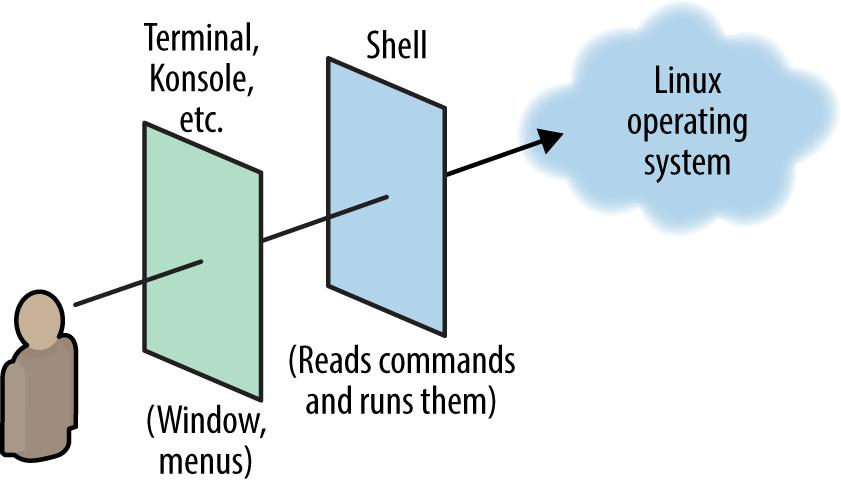
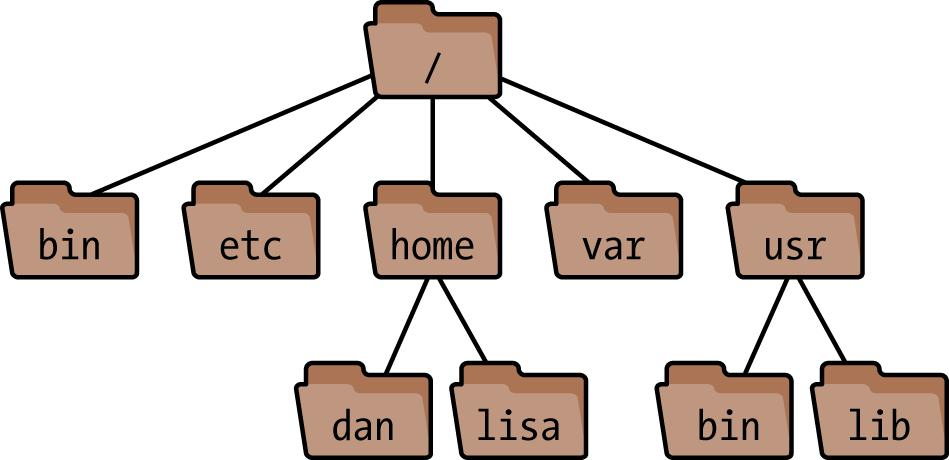
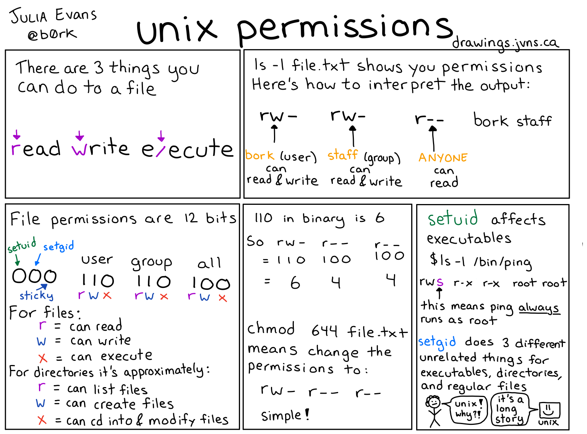
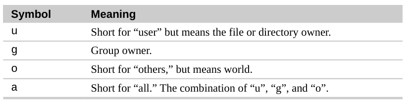
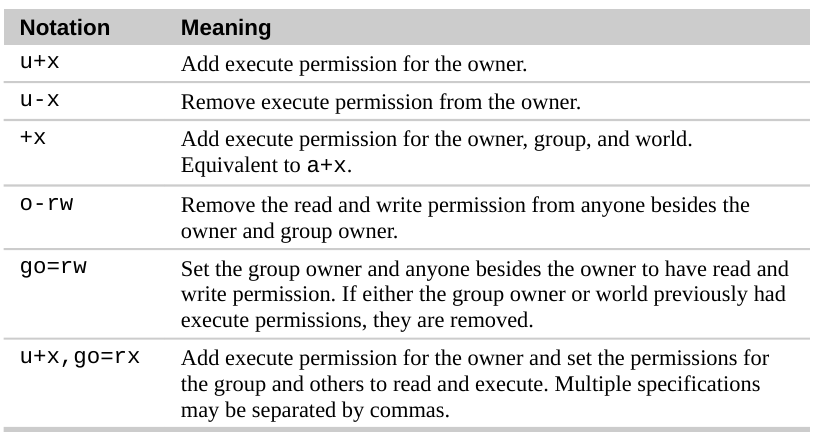

- [Goals](#goals)
- [Prerequisites](#prerequisites)
- [Linux: A First View](#linux-a-first-view)
  - [Shell](#shell)
  - [Input / Output](#input--output)
  - [Filesystem](#filesystem)
    - [Home Directories](#home-directories)
    - [System Directories](#system-directories)
      - [Scopes](#scopes)
      - [Categories](#categories)
    - [Permissions](#permissions)
  - [Users and Superusers](#users-and-superusers)
- [Bash Features](#bash-features)
  - [Variables](#variables)
  - [Input/output Redirection](#inputoutput-redirection)
  - [Pipes](#pipes)
    - [A word of warning!](#a-word-of-warning)
  - [Combining Commands](#combining-commands)
  - [Quoting](#quoting)
- [Basic Commands](#basic-commands)
  - [File and directory operations](#file-and-directory-operations)
  - [File viewing](#file-viewing)
  - [File creation and editing](#file-creation-and-editing)
  - [File properties](#file-properties)
  - [File text manipulation](#file-text-manipulation)
    - [More advanced manipulations](#more-advanced-manipulations)
  - [File compression](#file-compression)
  - [Processes](#processes)
  - [Controlling processes](#controlling-processes)
  - [Scheduling jobs](#scheduling-jobs)
  - [Users and their environment](#users-and-their-environment)
  - [Network connections](#network-connections)
  - [Performing HTTP requests](#performing-http-requests)
  - [Becoming the Superuser (root)](#becoming-the-superuser-root)
- [Creating and running shell scripts](#creating-and-running-shell-scripts)
  - [Checklist](#checklist)
  - [Exit codes](#exit-codes)
- [Resources:](#resources)

# Goals

- Understand the philosophy of Linux
- Know how to use Bash
- Know how to navigate the filesystem and set file permissions
- Know how to manage installed software
- Know how to write shell scripts using most common commands

# Prerequisites

- A machine running some Linux distro (e.g. Ubuntu, CentOS, Fedora, etc.) locally or on the cloud  
  -- or --
- A Docker container with Linux (`docker run -ti ubuntu:bionic`)

# Linux: A First View

Linux has 4 major parts (or layers):

**The kernel**: The low-level operating system, handling files, disks, networking, and other necessities we take for granted. Most users won't notice the kernel.

**Programs**: Programs for file manipulation, text editing, web browsing, audio, video, programming... whatever.

**The shell**: A user interface for typing commands, executing them, and displaying the results. Linux has various shells: bash, zsh, fish.

**X / Wayland**: Graphical systems that provide windows, menus, icons, mouse support, and other familiar GUI elements.

## Shell



The window program (Terminal, Konsole, etc.) is not the shell. It's just a graphical program that runs a shell on your behalf. The shell is what prompts you for commands and runs them.

## Input / Output

Input can come from files or from _standard input_, which is usually your keyboard. Likewise, output is written to files or to _standard output_, which is usually your shell window or screen. Error messages are treated specially and displayed on _standard error_, which also is usually your screen but kept separate from standard output.

## Filesystem



In a shell, files and directories are not constantly visible, so at times you must remember which directory you are in and how it relates to other directories. Use shell commands like `cd` and `pwd` to navigate between directories and keep track of where you are.

The topmost directory is called the _root directory_ and is denoted by a slash (`/`).

Two special relative paths are denoted `.` (current dir) and `..` (parent dir).

### Home Directories

Users' personal files are often found in the directory `/home` (for ordinary users) or `/root` (for the superuser). Your home directory is typically `/home/<your-username>`. There are several ways to locate or refer to your home directory:

```
cd
echo $HOME
echo ~
cd ~bob
```

### System Directories


#### Scopes

```
/                               # system files supplied with Linux
/usr                            # more system files supplied with Linux
/usr/local                      # system files developed "locally"
```

#### Categories

```
bin                             # programs (usually binary files)
sbin                            # programs (usually binary files)
lib                             # libraries of code used by programs
etc                             # configuration files for the system
log                             # log files that track important system events
```

### Permissions

To see the ownership and permissions of a file, simply use `ls` in the directory it belongs to:

```
➜ ls -l
-rw-rw-r--. 1 nstamatopoulos nstamatopoulos     114 Nov 28 12:30 README.md
drwxrwxr-x. 3 nstamatopoulos nstamatopoulos    4096 Dec  9 16:31 static
```







In more detail: https://askubuntu.com/a/518260

## Users and Superusers

Each user is identified by a username, and owns a private part of the system for doing work.

There is a special user named _root_ who has the privileges to do anything at all on the system. Ordinary users are restricted: though they can run most programs, in general they can modify only the files they own. The superuser, on the other hand, can create, modify, or delete any file and run any program.

# Bash Features

## Variables

```
➜ MYVAR=2
➜ echo $MYVAR
```

To make a variable and its value available to other programs your shell invokes, use the `export` command:

```
➜ export MYVAR=3
➜ printenv MYVAR
```

To make variables persist across your sessions, you need to place the `export` commands into special files in your home directory: _~/.bash_profile_ (sourced when you log in) or _~/.bashrc_ (sourced when you open a shell).

> To understand what runs and when, for `sh`, `bash`, `zsh`, have a look here: https://blog.flowblok.id.au/2013-02/shell-startup-scripts.html

To provide the value of an environment variable to a specific program just once, prepend _variable=value_ to the command:

```
➜ printenv HOME
/home/smith
➜ HOME=thisIsMyHomeNow printenv HOME
thisIsMyHomeNow
```

## Input/output Redirection

Any command that reads from stdin can have its input come from a file instead with the shell's `<` operator:

```
➜ any_command < infile
```

Likewise, any command that writes to stdout can write to a file instead:

```
➜ any_command > outfile           # Create/overwrite outfile
➜ any_command >> outfile          # Append to outfile
```

## Pipes

Redirect the standard output of one command to be the standard input of another, using the shell’s pipe (`|`) operator:

```
➜ ls -l | awk '{print $9}' | sort -r
```

### A word of warning!

Piping commands into bash is powerful but can also be dangerous. First make sure you know exactly which commands will be executed. You don’t want to pipe an unexpected `rm` command to bash and delete valuable files.

If someone asks you to retrieve a web page (say, with the `curl` command) and pipe it blindly into bash, don’t do it! Instead, capture the web page as a file (with curl or wget), examine it closely, and make an informed decision whether to execute it with bash.

## Combining Commands

To invoke several commands in sequence on a single line, separate them with semicolons:

```
➜ command1 ; command2 ; command3
```

To stop execution if any of them fails, separate them with `&&`:

```
➜ command1 && command2 && command3
```

To stop execution as soon as one succeeds, separate them with `||`:

```
➜ command1 || command2 || command3
```

## Quoting

Single quotes treat their contents literally, while double quotes let shell constructs be evaluated, such as variables:

```
➜ echo 'The variable HOME has value $HOME'
The variable HOME has value $HOME

➜ echo "The variable HOME has value $HOME"
The variable HOME has value /home/bob
```

A dollar sign and parentheses cause their contents to be evaluated as a shell command:

```
➜ echo "This year is $(date +%Y)"
This year is 2016
```

# Basic Commands

Most commands have manpages:  
 `$ man <COMMAND>`
Alternatively, they show some help with `--help`.
If you cannot find the answer there, your immediate instinct should be to look it up on the web!

## File and directory operations

```
ls                          List files in a dir
cp                          Copy a file
mv                          Rename ("move") a file
rm                          Delete ("remove") a file
ln                          Create links (alternative names) to a file

cd                          Change your current dir
pwd                         Print the name of your current dir
mkdir                       Create (make) a dir
rmdir                       Delete (remove) an empty dir
rm -r                       Delete a nonempty directory and its contents
```

## File viewing

```
cat                         View files in their entirety
less                        View text files one page at a time
head                        View the first lines of a text file
tail                        View the last lines of a text file
```

## File creation and editing

```
vim
nano
emacs
```

Quickly create a file:

```
➜ touch newfile
➜ echo anything > newfile
```

Cheatsheets:

- Vim: https://vim.rtorr.com/
- Nano: https://www.nano-editor.org/dist/latest/cheatsheet.html

## File properties

```
stat                        Display attributes of files and dirs
wc                          Count bytes, words, and lines in a file
du                          Measure disk usage of files and dirs
file                        Identify (guess) the type of a file
touch                       Change timestamps of files and dirs
chown                       Change owner of files and dirs
chgrp                       Change group ownership of files and dirs
chmod                       Change protection mode of files and dirs
```

## File text manipulation

```
grep                        Find lines in a file that match a regular expression
tr                          Translate characters into other characters
sort                        Sort lines of text by various criteria
uniq                        Locate identical lines in a file
```

### More advanced manipulations

**awk**: a pattern-matching language. Matches data by regular expression and then performs actions based on the data.

Examples:

```
# Print the second and fourth word on each line:
➜ awk '{print $2, $4}' myfile

# Print all lines that are shorter than 60 characters:
➜ awk 'length < 60 {print}' myfile
```

**sed**: a pattern-matching engine that can perform manipulations on lines of text.

Examples:

```
# Print the file with all occurrences of the string "me" changed to "YOU":
➜ sed 's/me/YOU/g' myfile

# Print the file with the first 10 lines removed:
➜ sed '1,10d' myfile
```

## File compression

```
tar                         Package multiple files into a single file
gzip                        Compress files with GNU Zip
gunzip                      Uncompress GNU Zip files
zip                         Compress files in Windows Zip format
unzip                       Uncompress Windows Zip files
```

Examples:

```
➜ tar -czf myarchive.tar.gz mydir      # memorize flags: Compress Ze Files
➜ tar -xzf myarchive.tar.gz            # memorize flags: Xtract Ze Files
```

## Processes

```
ps                          List processes
top                         Monitor resource-intensive processes interactively
htop                        Ratchet is to wrench as htop is to top
free                        Display free memory
```

## Controlling processes

```
kill                        Terminate a process (or send it a signal)
```

## Scheduling jobs

```
crontab                     Schedule jobs for many future times
```

## Users and their environment

```
whoami                      Print your username
id                          Print the user ID and group membership of a user
who                         List logged-in users, long output
users                       List logged-in users, short output
printenv                    Print your environment
```

## Network connections

```
ssh                         Securely log into a remote host, or run commands on it
scp                         Securely copy files to/from a remote host (batch)
ftp                         Copy files to/from a remote host (interactive, insecure!)
netcat                      Create arbitrary network connections
```

## Performing HTTP requests

```
curl                        Perform a request (writes to stdout by default)
wget                        Download web pages and files
```

## Becoming the Superuser (root)

```
➜ sudo rm protected_file
➜ sudo bash
```

# Creating and running shell scripts

## Checklist

1. Prepend `#!/bin/bash` (or `#!/usr/bin/env sh` for portability)
2. Make the file executable:
   ```
   ➜ chmod +x myscript.sh
   ```
3. Run as `./myscript.sh`.

## Exit codes

To the shell, the value `0` means true or success, and anything else means false or failure. (Think of zero as "no error" and other values as error codes.)

Every Linux command returns an integer value, called a return code or exit status, to the shell when the command exits. You can see this value in the special variable `$?`:

```
➜ cat myfile
My name is Bob and
I really like Linux

➜ grep Bob myfile
My name is Bob and

➜ echo $?
0

➜ grep asdfg myfile

➜ echo $?
1
```

---

# Resources:

1. Linux Pocket Guide, _Daniel J. Barrett_, 3rd Edition, June 2016, O'Reilly Media, Inc.
2. Julia's Drawings, Julia Evans, https://drawings.jvns.ca/
3. Bash Pitfalls, Greg's Wiki, https://mywiki.wooledge.org/BashPitfalls
4. [The Book of Secret Knowledge](https://github.com/trimstray/the-book-of-secret-knowledge), `trimstray`, GitHub.
5. [The Missing Semester of Your CS Education](https://missing.csail.mit.edu/), MIT.
