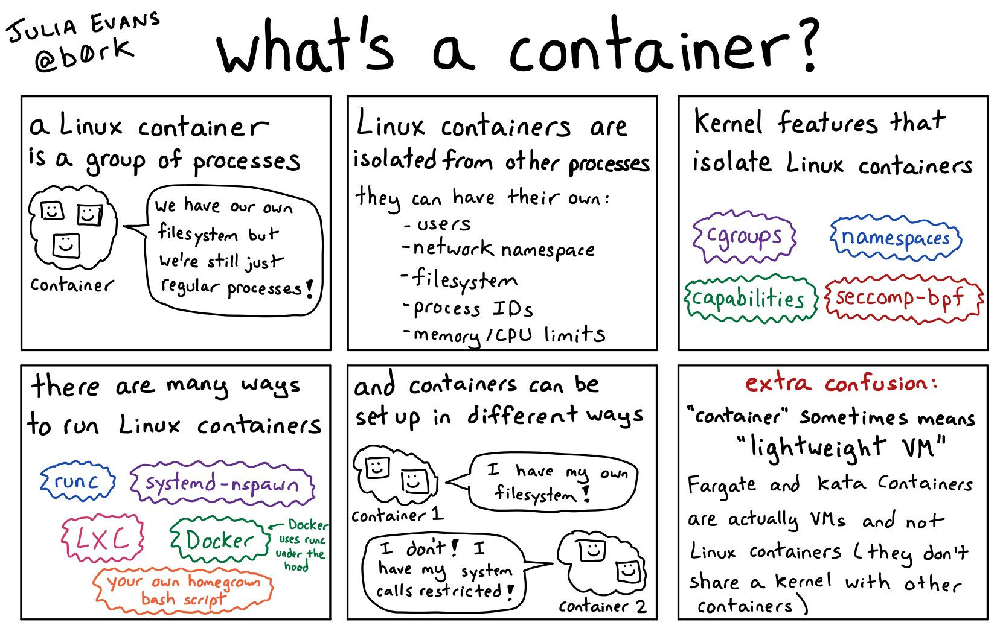

- [Goals](#goals)
- [Why containers?](#why-containers)
- [Intro to Docker](#intro-to-docker)
  - [Run a One-Off Container](#run-a-one-off-container)
  - [What Happens When You Run 'docker run hello-world'](#what-happens-when-you-run-docker-run-hello-world)
  - [Basic Commands of the CLI](#basic-commands-of-the-cli)
- [Dockerfiles](#dockerfiles)
  - [Best Practices](#best-practices)
    - [Understand your tools & ensure reproducible builds](#understand-your-tools--ensure-reproducible-builds)
    - [Use pinned versions to futureproof your pipelines](#use-pinned-versions-to-futureproof-your-pipelines)
      - [Be smart with what you copy to utilise layer caching](#be-smart-with-what-you-copy-to-utilise-layer-caching)
      - [Use a _.dockerignore_ file](#use-a-dockerignore-file)
      - [Use multiple stages to optimize for size](#use-multiple-stages-to-optimize-for-size)
- [Using a Container Registry](#using-a-container-registry)
- [Docker Compose](#docker-compose)
- [Handling Configuration & Secrets](#handling-configuration--secrets)
  - [Configuration](#configuration)
  - [Secrets](#secrets)
- [In depth: Containers as Isolated Processes (Native Containers Only)](#in-depth-containers-as-isolated-processes-native-containers-only)
- [In depth: Layers and Filesystem](#in-depth-layers-and-filesystem)
- [Resources](#resources)

# Goals

- Understand why to use containers
- Know how to run one-off containers
- Know how to craft Dockerfiles and build them
- Know how to use Docker Compose
- Understand core concepts (filesystem, secrets etc.) in more depth

# Why containers?

With containers, applications can be abstracted from the environment in which they actually run. This decoupling allows container-based applications to be deployed easily and consistently, regardless of whether the target environment is a private data center, the public cloud, or a developer's laptop. This gives developers the ability to create predictable environments that are isolated from rest of the applications and can be run anywhere.

# Intro to Docker

## Run a One-Off Container

You can run a one-off container to easily test an app/framework. Existing Docker images (official or community-provided) can be found on [Docker Hub](https://hub.docker.com/).

Examples:

```
# hello, world
➜ docker run hello-world
```

```
# an nginx web server, with port `80` published to `localhost`
➜ docker run -p 80:80 nginx:alpine
```

```
# bash in Ubuntu, in interactive mode
➜ docker run -it ubuntu:bionic bash
```

```
# a tool with arguments
➜ docker run busybox echo 'hello from busybox'
```

## What Happens When You Run 'docker run hello-world'

Docker CLI passes your request to the Docker daemon. The daemon downloads the image from Docker Hub, creates a new container by using the image it downloaded. Then, it redirects output from the container to the Docker CLI which redirects it to the standard output.

## Basic Commands of the CLI

List running containers:

```bash
➜ docker ps
```

List all (running & exited) containers:

```bash
➜ docker ps -a
```

List images:

```bash
➜ docker images
```

Build image from Dockerfile and tag it:

```bash
➜ docker build CONTEXT_PATH --tag=IMAGE_NAME
```

# Dockerfiles

A Dockerfile contains all the commands a user could call on the command line to assemble an image.

Here's a minimal working example that can be used for a JS project (although not recommended for production use):

```dockerfile
FROM node
WORKDIR /build
COPY . .
RUN yarn install && yarn build
```

Assuming the current dir as the build _context_:

```bash
➜ docker build . --tag=my-app:1.0
➜ docker run my-app:1.0
```

## Best Practices

### Understand your tools & ensure reproducible builds

Use lockfiles to ensure all dependencies are the same version on each and every build.

Even lockfiles may not always be respected though. Yarn has this behavior. On `yarn install` the default behavior is that the _yarn.lock_ file is mutated if _package.json_ and _yarn.lock_ are out of sync ([GitHub issue](https://github.com/yarnpkg/yarn/issues/4147)).

As mentioned in the [documentation](https://yarnpkg.com/en/docs/cli/) of Yarn:

> _If you need reproducible dependencies, which is usually the case with the continuous integration systems, you should pass `--frozen-lockfile` flag._

### Use pinned versions to futureproof your pipelines

Referencing an image by tag is always a gamble. If you want your builds to withstand version updates, lock their versions with the tag.

```dockerfile
# don't do this!

FROM node:latest
FROM node:lts
```

```dockerfile
# do this!

FROM node:12.14.1-alpine3.11
```

Note: The tag `12.14.1-alpine3.11` could still be overwritten by the author of the project on Docker Hub. This means that it could point to another _digest_. If you use a tag, you're simply relying on the integrity of the author of the Docker image.

If you're building an app where it's critical to provide reproducible results or cause the build to fail otherwise, you should pin the image versions by digest:

```dockerfile
# do this if your project is mission-critical, or you're a bit paranoid inside
# (in which case you shouldn't be pulling from Docker Hub at all...)

FROM node:12.14.1-alpine3.11@sha256:fe2cd1b5a9faf21497b73b37f24ad391ac39e72167e435217e9009c836e6da5d
```

In this case, the tag is ignored by Docker, so you could as well omit it. It's only used as info to your fellow devs.

#### Be smart with what you copy to utilise layer caching

Consider the following Dockerfile:

```dockerfile
# don't do this!

FROM node:12.14.1-alpine3.11
WORKDIR /build
COPY . .
RUN yarn install --frozen-lockfile && yarn build
CMD ["node", "/build/dist/main.js"]
```

Assume this is built on every commit, on a self-hosted CI agent. Let's look at two consecutive builds:

- _Build #001:_  
  Cache state: `node:12.14.1-alpine3.11` exists, but cache is cold otherwise.  
  Goes through all steps. The `RUN` step takes most of the time.  
  **Build time: ~74 seconds.**
- _Build #002:_  
  Cache state: All layers from #001 are in the cache.  
  The new commit changed something in the source, but doesn't change dependencies. However, it invalidates cache for the `COPY` step. The builder has to run all steps from `COPY` onwards.  
  **Build time: ~71 seconds.**

We can prevent this undesired cache invalidation by isolating the install step with only the files it needs:

```dockerfile
# do this!

FROM node:12.14.1-alpine3.11
WORKDIR /build
COPY package.json yarn.lock ./
RUN yarn install --frozen-lockfile
COPY . .
RUN yarn build
CMD ["node", "/build/dist/main.js"]
```

The first `COPY` copies only the two files required to fetch dependencies. The cache for this layer is only invalidated if dependencies change (happens infrequently).

The builds for the same commit sequence would now go as follows:

- _Build #001:_  
  Cache state: `node:12.14.1-alpine3.11` exists, but cache is cold otherwise.  
  Goes through all steps. The `RUN` step takes most of the time.  
  **Build time: ~74 seconds.**
- _Build #002:_  
  Cache state: All layers from #001 are in the cache.  
  The new commit changes something in the source, but doesn't change dependencies. Cached layers can be re-used for the `yarn install` command. The builder has to run all steps from the **second** `COPY` onwards.  
  **Build time: ~11 seconds.**

Build time **reduced by 85%**, only by thinking through what our commands need in order to run.

#### Use a _.dockerignore_ file

Besides crafting our Dockerfile in a smart way, we also have the _.dockerignore_ file in our toolbox. It uses the well-known _.gitignore_ syntax to remove certain files from the build context sent to the Docker daemon (that is before the build starts).

It helps you to solve some cases of undesired cache invalidation, as well as to avoid unnecessarily sending large or sensitive files and directories to the daemon and potentially adding them to images using `ADD`/`COPY`.

More : https://codefresh.io/docker-tutorial/not-ignore-dockerignore-2/

Reference: https://docs.docker.com/engine/reference/builder/#dockerignore-file

#### Use multiple stages to optimize for size

Consider the Dockerfile we ended up with before.

```dockerfile
# don't do this!

FROM node:12.14.1-alpine3.11
WORKDIR /build
COPY package.json yarn.lock ./
RUN yarn install --frozen-lockfile
COPY . .
RUN yarn build
CMD ["node", "/build/dist/main.js"]
```

We build and tag it as `size-optim-example:initial`. This Dockerfile uses layer caching nicely, but the resulting image is very large, which makes push/pull operations very slow.

We can improve it by assembling a lean, minimal final image:

```dockerfile
# do this!

FROM node:12.14.1-alpine3.11 AS build
WORKDIR /build
COPY package.json yarn.lock ./
RUN yarn install --frozen-lockfile
COPY . .
RUN yarn build

FROM mhart/alpine-node:slim-12.14.1
WORKDIR /app
COPY --from=build /build/dist ./
COPY --from=build /build/node_modules ./node_modules
CMD ["node", "main.js"]
```

We build and tag it as `size-optim-example:improved`.

Now let's get the image sizes:

```bash
➜ docker images --format='{{.Repository}}:{{.Tag}}\t{{.Size}}' | grep size-optim-example
size-optim-example:initial      1.49GB
size-optim-example:improved     314MB
```

Image size **reduced by 79%**, only with a careful selection of what our final image needs to contain at runtime.

# Using a Container Registry

You can pull/run an image from any container registry by specifying a fully-qualified path to the image.

Examples:

```bash
➜ docker pull myprivateregistry.azurecr.io/my-app/api:latest
```

If the registry requires authentication, then you will have to login first. Credentials are then stored in the user's home folder and are used every time you pull images from that

```bash
➜ docker login --username nickstam myprivateregistry.azurecr.io
Password:       # enter your password or token
```

**Best practice:** Use robot accounts or tokens when you have to do a login on a CI pipeline or any automated process. There are mainly two reasons for this:

- You can usually apply fine-grained access control over the repositories that this account should have access to
- You can revoke the tokens if they are accidentally leaked to the public

# Docker Compose

Docker Compose is a higher-level interface to the Docker Engine that allows you to put together containers and form networks of several services. This is all declared in a YAML file called _docker-compose.yml_.

```yaml
# docker-compose.yml

version: "3.7"

services:
  postgres:
    image: postgres:12.1
    restart: unless-stopped
    environment:
      POSTGRES_USER: root
      POSTGRES_PASSWORD: root
    ports:
      - "5432:5432"

  redis:
    image: redis:5-alpine
    restart: unless-stopped
    ports:
      - "6379:6379"

  api:
    build: apps/api
    restart: unless-stopped
    depends_on:
      - db
      - redis
    ports:
      - "3333:3333"

  proxy:
    build: apps/proxy
    restart: unless-stopped
    ports:
      - "80:80"
```

# Handling Configuration & Secrets

Let's set some ground rules:

- Images should not contain environment-dependent configuration
- Secrets are secret. They should **never** find their way into container images

## Configuration

Configuration can be passed via environment variables. In Docker CLI or Docker Compose commands you can specify env vars or mount volumes. In Kubernetes, you can use env vars or use a `ConfigMap` resource. More on that in the Kubernetes lesson.

## Secrets

Secrets should be passed as environment variables during runtime, or mounted as read-only files in certain safe locations.

In recent versions of the Docker Compose schema, you can specify files with secrets which then become available during runtime under `/run/secrets/`.

In Kubernetes, you can use a `Secret` resource and pass its contents to your container.

# In depth: Containers as Isolated Processes (Native Containers Only)

When learning Docker for the first time, it's easier to think of containers as virtual machines that are fully isolated.

In reality, however, things can be very different. Containers (when running _natively_) are merely processes that have strict restrictions in terms of what they can "see".

- On Linux, Linux containers run _natively_ with Docker CE && EE.
- On Windows, Windows containers run _natively_ with Docker EE (Win Server 2016+). Linux containers work using a virtual machine called _MobyVM_, and more recently, using an experimental technology called _LCOW (Linux Containers On Windows)_ (Win Server 2019+).



# In depth: Layers and Filesystem

The most common filesystem used to build images is `overlayfs`. It has the feature of creating _diffs_ of filesystem layers and stacking them on top of each other to construct the final image.

Every directive in your Dockerfile produces a layer, which is _diff_-ed with the previous one and applied on top of it. This allows for clever caching techniques as we saw above.

All layers of an image are read-only, except for the last one. The last one is used when you create a container from the image.


---

# Resources

1. https://jvns.ca/blog/2016/10/10/what-even-is-a-container/
2. https://jvns.ca/blog/2019/11/18/how-containers-work--overlayfs/
3. https://jvns.ca/blog/2016/12/22/container-networking/
4. https://www.youtube.com/watch?v=-YnMr1lj4Z8
5. https://stackoverflow.com/a/46650343
6. http://alexander.holbreich.org/docker-components-explained/
7. https://github.com/p8952/bocker
8. https://www.ianlewis.org/en/container-runtimes-part-1-introduction-container-r
9. https://github.com/containers/libpod
10. https://github.com/containers/buildah
11. https://www.ardanlabs.com/blog/2020/02/docker-images-part1-reducing-image-size.html
12. https://www.ardanlabs.com/blog/2020/02/docker-images-part2-details-specific-to-different-languages.html
