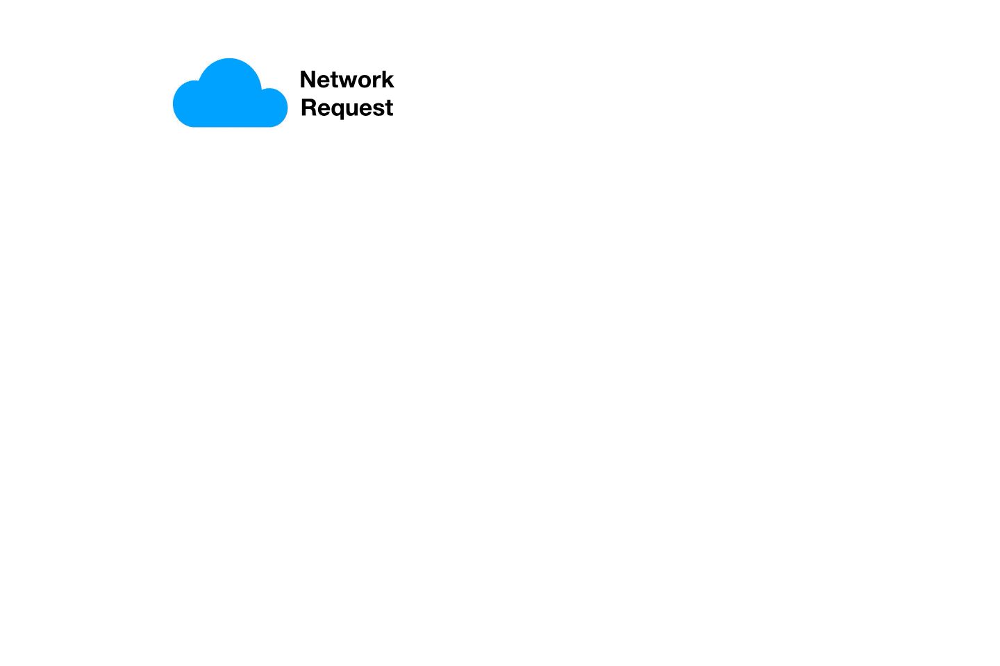
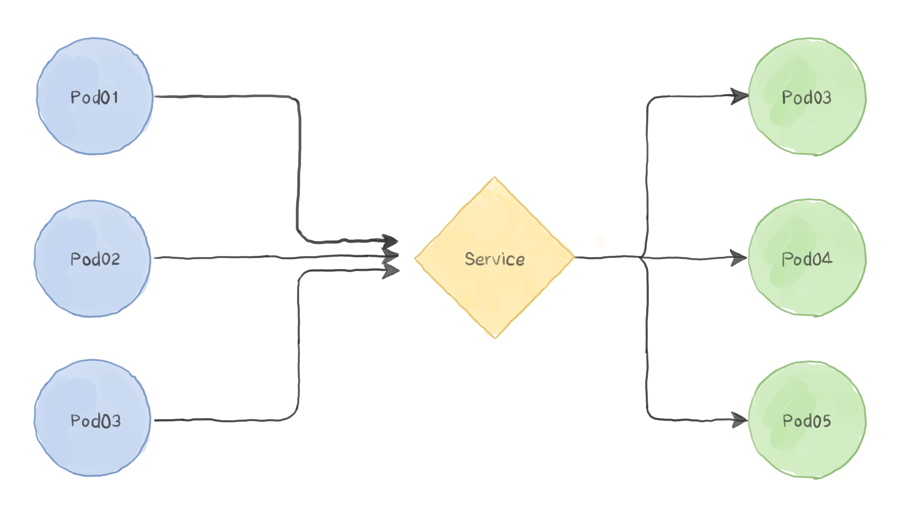
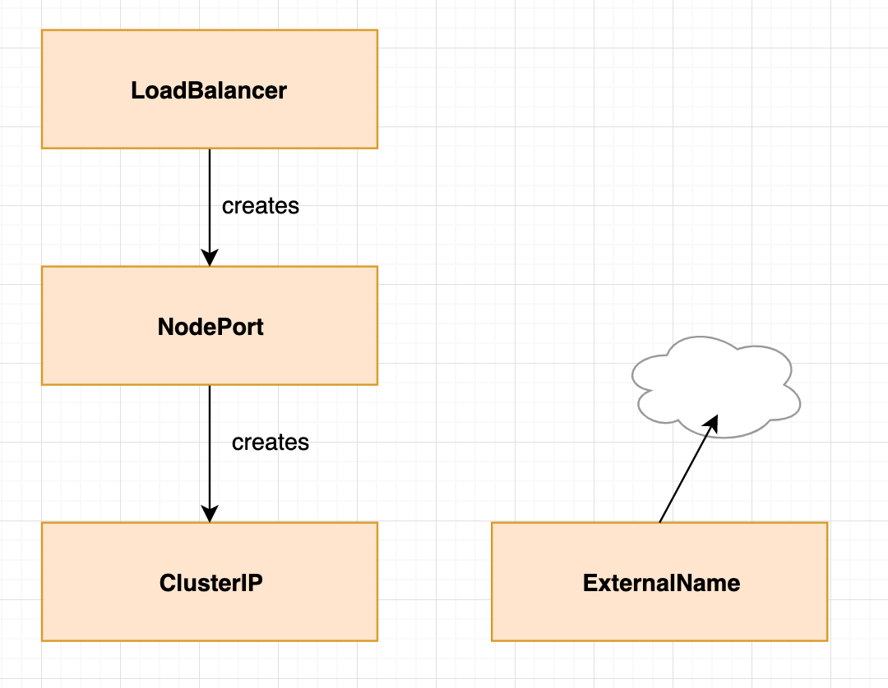

- [Intro: What is Kubernetes?](#intro-what-is-kubernetes)
- [Intro: Declarative Configuration](#intro-declarative-configuration)
- [Kubernetes Cluster Architecture](#kubernetes-cluster-architecture)
  - [Master Node Components](#master-node-components)
    - [`kube-apiserver`](#kube-apiserver)
    - [`etcd`](#etcd)
    - [`kube-controller-manager`](#kube-controller-manager)
    - [`kube-scheduler`](#kube-scheduler)
  - [Worker Node Components](#worker-node-components)
    - [`kubelet`](#kubelet)
    - [`kube-proxy`](#kube-proxy)
  - [Highly-Available Master Configurations](#highly-available-master-configurations)
- [How to Manage a Kubernetes Cluster](#how-to-manage-a-kubernetes-cluster)
  - [Using `kubectl`](#using-kubectl)
    - [Viewing Objects](#viewing-objects)
    - [Creating, Updating, Destroying Objects](#creating-updating-destroying-objects)
    - [Debugging](#debugging)
  - [Using Graphical UIs](#using-graphical-uis)
    - [Kubernetes Dashboard](#kubernetes-dashboard)
    - [Octant](#octant)
  - [Using Terminal UIs](#using-terminal-uis)
    - [k9s](#k9s)
- [Kubernetes Workloads](#kubernetes-workloads)
  - [Pods](#pods)
    - [Pod Design Considerations](#pod-design-considerations)
    - [Pod Manifest](#pod-manifest)
    - [Pod Health Checks](#pod-health-checks)
      - [Liveness Probe](#liveness-probe)
      - [Readiness Probe](#readiness-probe)
      - [Types of Checks](#types-of-checks)
      - [Example](#example)
    - [Pod Resource Management](#pod-resource-management)
      - [Resource Requests: Minimum Required Resources](#resource-requests-minimum-required-resources)
      - [Resource Limits: Maximum Required Resources](#resource-limits-maximum-required-resources)
      - [Example](#example-1)
      - [Advice on Setting Resource Limits](#advice-on-setting-resource-limits)
    - [Pod Volumes](#pod-volumes)
  - [ReplicaSets](#replicasets)
  - [Deployments](#deployments)
    - [Deployment Manifest](#deployment-manifest)
    - [Deployment Rollout Progress & History](#deployment-rollout-progress--history)
  - [ConfigMap](#configmap)
    - [ConfigMap Manifest Creation](#configmap-manifest-creation)
  - [Secret](#secret)
    - [Secret Manifest Creation](#secret-manifest-creation)
  - [Service & Ingress](#service--ingress)
    - [Service Overview](#service-overview)
      - [Service Manifest](#service-manifest)
      - [DNS for Services](#dns-for-services)
      - [Service Types](#service-types)
    - [Serving Multiple Services: The Ingress Controller](#serving-multiple-services-the-ingress-controller)
      - [Ingress Manifest](#ingress-manifest)
  - [Other Resources](#other-resources)
- [Custom Resources / Operators](#custom-resources--operators)
- [Resources](#resources)

# Intro: What is Kubernetes?

An open-source orchestrator for containerized applications. It is designed to help build and deploy reliable and scalable distributed systems.

# Intro: Declarative Configuration

_Declarative_ configuration is an alternative to _imperative_ configuration, where the state of the world is defined by the execution of a series of instructions rather than a declaration of the desired state of the world.

**While imperative commands define actions, declarative configurations define state.**

Everything in Kubernetes is a _declarative configuration object_ that represents the desired state of the system. It is Kubernetes' job to ensure that the actual state of the world matches this desired state.

This allows Kubernetes to be an online self-healing system. If you set a desired state of three replicas to Kubernetes, it does not just create three replicas - it continuously ensures that there are exactly three replicas.

# Kubernetes Cluster Architecture

At the hardware level, a Kubernetes cluster consists of several nodes, which can be split into two types:

- **Masters**, which host the Kubernetes control plane that controls and manages the whole system
- **Workers**, which run the actual workloads you deploy


## Master Node Components

Masters coordinate each node in the cluster, by scheduling pods, providing administrative interfaces to the cluster, and managing cluster-wide health and services.

### `kube-apiserver`

The Kubernetes cluster is exposed outside the cluster through the `kube-apiserver` component. The `kube-apiserver` is the only component that all other master and worker components can directly communicate directly with.

### `etcd`

`etcd` is a distributed, highly-available key value data store that Kubernetes uses to store cluster configuration. It holds metadata and the desired and current state for all resources. Any resource that is created is saved in `etcd`.

### `kube-controller-manager`

Kubernetes manages applications through various controllers that operate on the general model of comparing the current status against a known spec. These controllers are control loops that continuously ensure that the current state of the cluster (the status) matches the desired state (the spec). They watch the current cluster state stored in `etcd` through the `kube-apiserver` and create, update, and delete resources as needed.

### `kube-scheduler`

The kube-scheduler component is responsible for managing the scheduling of pods. Scheduling decision depends on a number of factors such as:

- Resource requirements of the app
- Resource availability across nodes
- Whether the pod spec has affinity labels requesting scheduling on particular nodes
- Whether the nodes have certain taints/tolerations preventing them from being included in the scheduling process

## Worker Node Components

Workers are the primary workhorses of Kubernetes clusters. While the master components handle most of the organization and logic, the worker nodes are responsible for running containers, reporting health information back to the masters, and managing access to the containers through network proxies.

### `kubelet`

The `kubelet` component is an agent that runs on every worker node of the cluster. It is responsible for managing all containers running in every pod in the cluster. It does this by ensuring that the current state of containers in a pod matches the spec for that pod stored in `etcd`.

The podspec might be passed through the `kube-apiserver` to `kubelet` to run pods on that particular node, or might be passed as a file with the kubectl command line tool. The kubelet agent manages the container runtime to make sure the containers operating on the machine are in the desired state.

### `kube-proxy`

The `kube-proxy` component is a network proxy that runs on each node. It is responsible for forwarding requests. The proxy is somewhat flexible and can handle simple or round robin TCP, UDP or SCTP forwarding. Each node interacts with the Kubernetes service through `kube-proxy`.

## Highly-Available Master Configurations


# How to Manage a Kubernetes Cluster

## Using `kubectl`

The official Kubernetes client is `kubectl`: a command-line tool.

Once you have a cluster running, you obtain a config file with credentials for it.

```bash
➜ export KUBECONFIG=$HOME/.kube/my-cluster-config

➜ kubectl version
➜ kubectl get nodes
```

We'll have a quick look at some `kubectl` command examples.

### Viewing Objects

View a single pod:

```
➜ kubectl get pod <pod-name>
```

View all information & events for a single pod:

```
➜ kubectl describe pod <pod-name>
```

### Creating, Updating, Destroying Objects

Apply an object manifest declaratively:

```
➜ kubectl apply -f object.yml
```

Delete the object declared in a manifest:

```
➜ kubectl delete -f object.yml
```

### Debugging

Obtain the logs of a pod:

```
➜ kubectl logs <pod-name>
```

Bash into a running pod:

```
➜ kubectl exec -it <pod-name> -- bash
```

Port-forward to a running pod:

```
➜ kubectl port-forward <pod-name> <local-port>:<remote-port>
```

Copy something from a running pod (relies on `tar`):

```
➜ kubectl cp <pod-name>:/path/to/remote/file /path/to/local/file
```

## Using Graphical UIs

### Kubernetes Dashboard

> https://github.com/kubernetes/dashboard

The Kubernetes Dashboard runs in the cluster and is served from it (usually accessed with `kubectl port-forward`). It may come pre-installed in some clusters. If not, you can just deploy it by following the instructions in the official repo.


### Octant

> https://github.com/vmware-tanzu/octant

Octant is developed by VMware and is distributed as a static binary. It runs locally, using your kubeconfig to connect to the cluster.


## Using Terminal UIs

### k9s

k9s is an open-source project and is distributed as a static binary. It runs locally, using your kubeconfig to connect to the cluster.


# Kubernetes Workloads

## Pods

A Pod represent a collection of application containers and volumes running in the same execution environment. Pods are the smallest deployable object in Kubernetes. All containers in a Pod always end up on the same machine.


### Pod Design Considerations

One could think that an application and its MySQL database server should be in the same Pod. However, this is an antipattern for Pod design.

1. Firstly, the app and its database don't have to live together. If they land on different machines, they can communicate over a network connection.
2. Secondly, you don't want to scale them together as a unit.

The right question to ask when designing Pods is:

> _Will those containers work correctly if they land on different machines?_

If the answer is "yes", using multiple Pods is the usually the correct solution.

### Pod Manifest

Here's an example pod manifest for the `whoami` application we saw in the previous lesson:

```yaml
apiVersion: v1
kind: Pod
metadata:
  name: whoami
spec:
  containers:
    - name: whoami
      image: traefik/whoami:v1.6.1
      ports:
        - name: http
          containerPort: 8080
          protocol: TCP
```

### Pod Health Checks

#### Liveness Probe

This probe confirms that the container is healthy. Containers that fail this check are restarted.

#### Readiness Probe

This probe confirms that the container is ready to receive traffic. Containers that fail this check are removed from service load balancers.

#### Types of Checks

The following probe types are available:

- `httpGet`: performs a GET request at a specific endpoint, succeeds if response is 2xx or 3xx
- `tcpSocket`: opens a TCP socket, succeeds if connection is successful
- `exec`: executes a command in the container, succeeds if command exits with 0

#### Example

Here we extend the previous pod manifest with probes:

```yaml
apiVersion: v1
kind: Pod
metadata:
  name: whoami
spec:
  containers:
    - name: whoami
      image: traefik/whoami:v1.6.1
      ports:
        - name: http
          containerPort: 8080
          protocol: TCP
      livenessProbe:
        httpGet:
          path: /health
          port: 8080
        initialDelaySeconds: 5
        timeoutSeconds: 1
        periodSeconds: 10
        failureThreshold: 3
```

### Pod Resource Management

#### Resource Requests: Minimum Required Resources

A Pod requests the resources to run its containers. Kubernetes guarantees that those resources are available to the Pod. The resources are declared per container, since containers may have different needs.

#### Resource Limits: Maximum Required Resources

You can also set a maximum on a Pod's resource usage via resource limites.

#### Example

Here we extend the whoami pod manifest with resource requests and limits:

```yaml
apiVersion: v1
kind: Pod
metadata:
  name: whoami
spec:
  containers:
    - name: whoami
      image: traefik/whoami:v1.6.1
      ports:
        - name: http
          containerPort: 8080
          protocol: TCP
      livenessProbe:
        httpGet:
          path: /health
          port: 8080
        initialDelaySeconds: 5
        timeoutSeconds: 1
        periodSeconds: 10
        failureThreshold: 3
      resources:
        requests:
          cpu: 100m
          memory: 32Mi
        limits:
          cpu: 200m
          memory: 64Mi
```

#### Advice on Setting Resource Limits

Regarding resource requests and limits, Tim Hockin, one of the founders of Kubernetes, has [commented](https://www.reddit.com/r/kubernetes/comments/clhi23/question_memory_requests_and_oom_killer_in/evx73nx/):

> There are two main grades of OOM - cgroup (which only happens if a process in your container is asking for memory and your container goes over its limit) and global (which happens when any process is asking for memory and can't get it, but is under it's container limit).
>
> **K8s packs the machine by requests.**
>
> That really means that any container which is over its request can cause problems for other containers . It also means that poorly managed system processes (e.g. docker) can cause problems for containers.
>
> This is why it is important to get the allocatable value right and to **set memory limit == request almost always.**

### Pod Volumes

To add a volume, we need two new sections in the configuration.

The first is the new `.spec.volumes` section, which defines all volumes that may be accessed by containers in the Pod.

The second is the `volumeMounts` array in the container spec, which defines the volumes that are mounted into a particular container.

An example is the most suitable way to explain the concept:

```yaml
apiVersion: v1
kind: Pod
metadata:
  name: whoami
spec:
  volumes:
    - name: certs # name to be used as a reference for this volume
      hostPath: # hostPath will provide a volume from the node where this Pod is scheduled
        path: /var/lib/whoami/certs
  containers:
    - name: whoami
      image: traefik/whoami:v1.6.1
      ports:
        - name: http
          containerPort: 8080
          protocol: TCP
      livenessProbe:
        httpGet:
          path: /health
          port: 8080
        initialDelaySeconds: 5
        timeoutSeconds: 1
        periodSeconds: 10
        failureThreshold: 3
      resources:
        requests:
          cpu: 100m
          memory: 32Mi
        limits:
          cpu: 200m
          memory: 64Mi
      volumeMounts:
        - name: certs # this is a reference to the declared volume above
          mountPath: /certs # mount path into the container
          readOnly: true
```

## ReplicaSets

ReplicaSets are wrappers around Pods that simply let you manage the number of Pods you want running at a given time. Kubernetes claims high availability and fault tolerance, and having multiple pods running helps achieve this. The job of the ReplicaSet is to ensure Kubernetes is running the configured number of Pods.

It's good to know that ReplicaSets exist and what they do, but you will rarely need to create or manage ReplicaSets directly. Deployments will manage ReplicaSets for you. You normally only need to deal with ReplicaSets when troubleshooting unexpected problems.

## Deployments

A Deployment manages your ReplicaSet, which in turn manages the number of Pods that should be running in your desired state.

However, it also manages a few more things for you such as updates, rollbacks, and scaling.

After you have deployed your Pod for the first time, there’s a good chance you are going to want to update it when you have a code fix or enhancement. Deployments can help manage this update and can even do a gradual rollout so that all of your Pods are not down at the same time. It will keep track of each update which will allow you to perform rollbacks. This can be very useful if something goes wrong with an update and you need to revert quickly.

### Deployment Manifest

```yaml
apiVersion: apps/v1
kind: Deployment
metadata:
  name: whoami
spec:
  replicas: 2
  selector:
    matchLabels:
      app: whoami
  strategy:
    type: RollingUpdate # accepted values: RollingUpdate, Recreate
    rollingUpdate:
      maxSurge: 1
      maxUnavailable: 1
  template:
    containers:
      - name: whoami
        image: traefik/whoami:v1.6.1
        ports:
          - name: http
            containerPort: 8080
            protocol: TCP
        livenessProbe:
          httpGet:
            path: /health
            port: 8080
          initialDelaySeconds: 5
          timeoutSeconds: 1
          periodSeconds: 10
          failureThreshold: 3
        resources:
          requests:
            cpu: 100m
            memory: 32Mi
          limits:
            cpu: 200m
            memory: 64Mi
```

### Deployment Rollout Progress & History

`kubectl rollout` provides commands to track the release history:

```
kubectl rollout status -w deployment/frontend
```

```
kubectl rollout history deployment/frontend
```

```
kubectl rollout undo deployment/frontend --to-revision=2
```

```
kubectl rollout restart deployment/frontend
```

However it's usually a better idea to treat releases as immutable and never change them on the cluster. All manifests should be committed to a repository.

## ConfigMap

Suppose you have a file with some Nginx configuration:

```
server {
  listen       8080;
  server_name  _;
  gzip         on;

  location / {
    root      /app;
    index     index.html;
    try_files $uri $uri/ $uri.html =404;
  }
}
```

Additionally, assume you have a configuration key-value pair: `LOG_LEVEL=debug` that your application needs.

Those data should not be present inside a container image, as they can depend on the target environment. For this, Kubernetes provides ConfigMap resources:

```yaml
apiVersion: v1
kind: ConfigMap
metadata:
  name: app-config
data:
  nginx.conf: |
    server {
      listen       8080;
      server_name  _;
      gzip         on;

      location / {
        root      /app;
        index     index.html;
        try_files $uri $uri/ $uri.html =404;
      }
    }
  LOG_LEVEL: debug
```

Data from ConfigMaps can be mounted as volumes into containers or used as environment vars:

```yaml
apiVersion: v1
kind: Pod
metadata:
  name: my-app
spec:
  volumes:
    - name: nginx-conf
      configMap:
        name: app-config
        items:
          - key: nginx.conf
            path: default.conf
  containers:
    - name: echo
      image: alpine:3.11
      command: ["/bin/sh", "-c", "echo $LOG_LEVEL"]
      env:
        - name: LOG_LEVEL
          valueFrom:
            configMapKeyRef:
              name: app-config
              key: LOG_LEVEL
    - name: nginx
      image: nginx:1.17.10-alpine
      volumeMounts:
        - name: nginx-conf
          mountPath: /etc/nginx/conf.d/
          readOnly: true
```

### ConfigMap Manifest Creation

To conveniently generate or apply ConfigMaps from local config files, use `kubectl`:

```
kubectl create configmap <configmap-name> -n <namespace> --from-file=/path/to/file --dry-run=client -o yaml > configmap.yml
kubectl create configmap <configmap-name> -n <namespace> --from-literal=KEY=VALUE --dry-run=client -o yaml > configmap.yml
```

```
kubectl create configmap <configmap-name> -n <namespace> --from-file=/path/to/file --dry-run=client -o yaml | kubectl apply -f -
```

## Secret

A similar concept exists for secrets. There are some additional things to consider:

- Secrets are base64-encoded
- Secrets have one of the following types:
  - `docker-registry` (for use with a Docker registry)
  - `generic` (any generic secret from a local file, directory or literal value)
  - `tls` (for a tls certificate)

### Secret Manifest Creation

Secrets provide an object called `stringData` for conveniently applying secrets that are not already base64-encoded. When you apply this:

```yaml
apiVersion: v1
kind: Secret
metadata:
  name: app-env
stringData:
  API_KEY: eD1yTHKvleFDP3HUBKb0pypLzZTCevRt
```

it turns into this:

```yaml
apiVersion: v1
kind: Secret
metadata:
  name: app-env
data:
  API_KEY: ZUQxeVRIS3ZsZUZEUDNIVUJLYjBweXBMelpUQ2V2UnQ=
```

Alternatively, you can again use `kubectl` to write the Secret to a file or directly apply it to the cluster:

```
kubectl create secret generic <secret-name> -n <namespace> --from-file=/path/to/file --dry-run=client -o yaml > secret.yml
kubectl create secret generic <secret-name> -n <namespace> --from-literal=SECRET_KEY=SECRET_VALUE --dry-run=client -o yaml > secret.yml
```

```
kubectl create secret generic <secret-name> -n <namespace> --from-file=/path/to/file --dry-run=client -o yaml | kubectl apply -f -
```

## Service & Ingress

### Service Overview

A Service enables network access to a set of Pods in Kubernetes.

Services select Pods based on their labels. When a network request is made to the service, it selects all Pods in the cluster matching the Service's selector, chooses one of them, and forwards the network request to it.



#### Service Manifest

```yaml
apiVersion: v1
kind: Service
metadata:
  name: whoami
  namespace: playground
spec:
  type: ClusterIP
  selector:
    app: whoami
  ports:
    - port: 8080
      targetPort: 8080
      protocol: TCP
```

#### DNS for Services

**A/AAAA records**

Services are assigned a DNS A or AAAA record (unless they're _headless_, which we'll skip for now), for a name of the form `my-svc.my-namespace.svc.cluster-domain.example`. This resolves to the cluster IP of the Service.

With the above example, any Pod in the cluster would be able to reach the _whoami_ service using `whoami.playground.svc.cluster.local` _(cluster.local suffix is the default)_.

#### Service Types

A Service can be one of those types:

- `ClusterIP` (default): Exposes the service on a cluster-internal IP. You can reach the service only from within the cluster (from other services).



- `NodePort`: This type of service exposes the service on each node's IP at a static port. A ClusterIP service is created automatically, and the NodePort service will route to it. From outside the cluster, you can reach the NodePort service by using `<NodeIP>:<NodePort>`. This is rarely used in production, since you're not supposed to reach a Node directly. It's usually just a way to test things out.


- `LoadBalancer`: This service type exposes the service externally by provisioning a load balancer of your cloud provider. The external load balancer routes to your NodePort and ClusterIP services, which are created automatically.


- `ExternalName`: This type maps the service to the contents of the externalName field (e.g., foo.bar.example.com). It does this by returning a value for the CNAME record.


An overview of all types:



### Serving Multiple Services: The Ingress Controller

If your application needs only one entrypoint for your clients to start using it, you can just use a Service of type LoadBalancer. However, many applications today expose more than one endpoint, which is why we use an Ingress controller.

The Ingress controller is exposed via a LoadBalancer service. Afterwards, it proxies HTTP traffic to different services according to a set of rules, which can be host-based and/or path-based.


#### Ingress Manifest

```yaml
apiVersion: networking.k8s.io/v1
kind: Ingress
metadata:
  name: my-app
  namespace: my-app
spec:
  rules:
    - http:
        paths:
          - path: /
            pathType: Prefix
            backend:
              service:
                name: web
                port:
                  number: 80
          - path: /api
            pathType: Prefix
            backend:
              service:
                name: api
                port:
                  number: 3000
```

## Other Resources

`StatefulSet`, `CronJob`, `Job`, `ServiceAccount`, `Role`, `ClusterRole`, `RoleBinding`, `ClusterRoleBinding`, ...

# Custom Resources / Operators

Kubernetes can be extended with custom resources & controllers. To be continued...

---

# Resources

1. https://tech.findmypast.com/road-to-k8s-ha-part-1/
2. https://tech.findmypast.com/k8s-dns-lookup/
3. https://github.com/rudoi/cruster-api
4. https://www.magalix.com/blog/kubernetes-patterns-the-service-discovery-pattern
